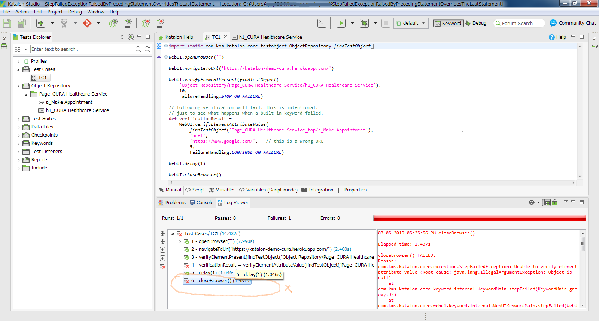

StepFailedException raised by preceding statement overrides the status of the last statement in a test case script
=============

## What is this?

This is a small Katalon Studio project to reproduce a problem.

This project was developed using Katalon studio 5.10.1.

## How to reproduce the problem

1. Download the zip of the project from [Releases](https://github.com/kazurayam/StepFailedExceptionRaisedByPreviousStatementOverridesTheLastStetement/releases) page.
2. Unzip the zip, open it with your Katalon Studio.
3. Select `Test Cases/TC1` and run it.


## Problem to solve

`TC1` script has the following statement:
```
def verificationResult =
	WebUI.verifyElementAttributeValue(
		findTestObject('Page_CURA Healthcare Service_top/a_Make Appointment'),
		'href',
		'https://www.google.com/',   // this is a wrong URL
		5,
		FailureHandling.CONTINUE_ON_FAILURE)
```
This statement will fail. This is intentional. This is not a prblem.

`TC1` script has the followin statement at the end.
```
WebUI.closeBrowser()
```
Nobody would expect that this statement to fail.

But, when you run the `TC1` and you watch the Log Viewer, you will find Katalon Studio reports that the `closeBrowser()` failed!

See the following screenshot.


## My thought

Of course, `WebUI.closeBrowser()` statement actually succeeds, does not fail.

The thing is, the StepFailedException raised by the previous `verifyElementAttributeValue()` statement is reported as if it was raised by the `closeBrowser()`.

Katalon Studio seems to have a problem in handling StepFailedException.
